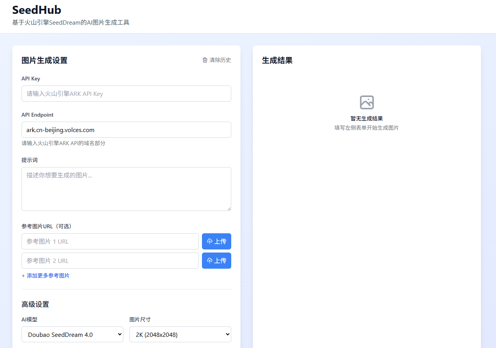

# SeedHub - 火山引擎AI图片生成工具

基于火山引擎SeedReam API的AI图片生成工具，支持文本到图片和图片到图片的生成功能。



## 快速开始

### 1. 安装依赖
```bash
pnpm install
```

### 2. 启动开发服务器
```bash
pnpm run dev
```

### 3. 构建项目
```bash
pnpm run build
```

## 使用说明

1. **获取API Key**: 在火山引擎控制台获取ARK API Key
2. **输入API Endpoint**: 填入你的火山引擎API域名
3. **输入提示词**: 描述你想要生成的图片内容
4. **添加参考图片**（可选）: 
   - 直接输入图片URL
   - 或点击"上传"按钮选择本地图片
5. **配置参数**: 选择图片尺寸、数量等参数
6. **生成图片**: 点击生成按钮开始创作

## 部署

本项目需要使用 **Vercel** 

1. 将项目推送到GitHub仓库
2. 在Vercel中导入GitHub仓库
3. 一键部署，无需额外配置

## 许可证

MIT License